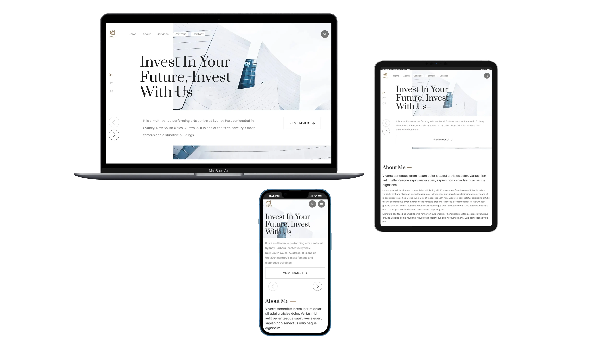

# ARCT

**Role:**  
Front-End Developer | Responsive Design | JavaScript Interactivity | Custom UI Components  

🌐 [View Live Project](https://oleksandrmul.github.io/arct/)

---

## Overview  
Created a modern, visually striking landing page for an architecture and building design company specializing in unique constructions, conceptual buildings, hotels, and commercial projects.
The website highlights services such as Planning Process, Unique Design, Consultation, and Architecture Portfolio, and reflects the brand’s core message:

“Invest in your Future, Invest with us.”

The project combines clean structure, smooth animation, and rich interactivity to deliver a premium user experience. 

---

## Key Achievements  
- ✅ Implemented smooth UI animations, hover effects, and scroll navigation to enhance usability.
- ✅ Integrated responsive Swiper sliders, including a complex hero slider built for adaptive stability.
- ✅ Developed fully custom JavaScript spoilers (accordions) to save space and improve content organization.
- ✅ Built tab navigation in the portfolio section and integrated Lightgallery JS for a better image-viewing experience (zoom, navigation, download).
- ✅ Created a fully custom contact form with validation, ensuring secure and correct submissions.
- ✅ Added a preloader for a polished loading experience.
- ✅ Implemented JS-powered numeric counters for visual impact.
- ✅ Designed a unique CSS column-count layout for the services grid, improving responsiveness and structure.
- ✅ Ensured full accessibility compliance using semantic HTML and ARIA attributes.
- ✅ Delivered complete responsive adaptation across all device sizes.

---

## Outcome  
Completed a premium, business-oriented architectural landing page with interactive elements, custom functionality, and strong visual structure.
The combination of sliders, accordions, tabs, and galleries creates a dynamic and engaging browsing experience while maintaining reliability and professional clarity.

---

## Conclusions  
ARCT demonstrates how thoughtful UI design, custom JavaScript components, and accessibility-focused development can elevate a high-end business website.
From the adaptive hero slider to custom-built spoilers, validated forms, and image galleries, the project showcases strong attention to detail and practical, user-centered solutions.

If you’re looking for a developer who can build modern, interactive, and polished landing pages, I’d be happy to collaborate on your next project.
